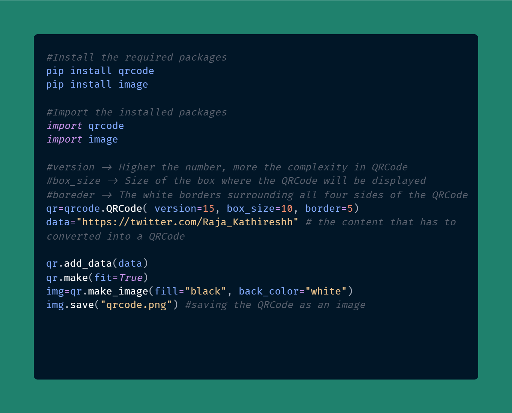

# QRcode 😍
## An ultra mini project solely written on python to generate a QRCode 👌 ##
QR – which stands for “Quick Response” – code is basically a barcode on steroids. While the barcode holds information horizontally, the QR code does so both horizontally and vertically

The output of the above code is show below 👇 

<b>🔔 Try this</b>- Scan the QRCode and Follow me 🙏

